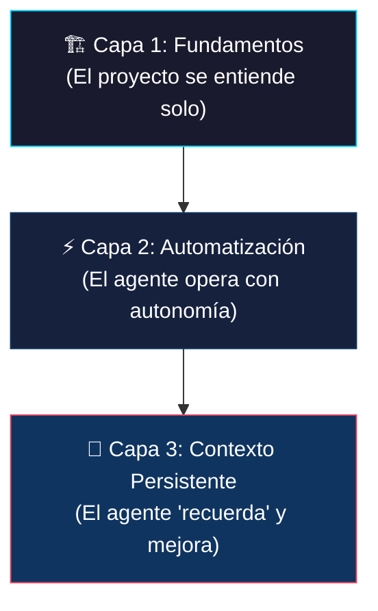

# 🤖 Análisis: Integración Profesional de AI en Proyectos de Desarrollo

> Análisis profundo basado en el proyecto **CoPark** — aplicable como marco teórico a cualquier proyecto.

---

## 1. Diagnóstico Actual del Proyecto

### Lo que ya tienes bien configurado ✅

| Herramienta                   | Archivo                                                                                      | Impacto para AI                                                                                  |
| ----------------------------- | -------------------------------------------------------------------------------------------- | ------------------------------------------------------------------------------------------------ |
| **EditorConfig**              | [.editorconfig](file:///d:/Users/Daniel/01_Projects/copark/copark-api/.editorconfig)         | El agente hereda indentación, charset y EOL automáticamente                                      |
| **Prettier**                  | [.prettierrc](file:///d:/Users/Daniel/01_Projects/copark/copark-api/.prettierrc)             | Formato determinista — el agente genera código que no necesita reformateo                        |
| **ESLint strict**             | [eslint.config.mjs](file:///d:/Users/Daniel/01_Projects/copark/copark-api/eslint.config.mjs) | `strictTypeChecked` + `stylisticTypeChecked` = el agente recibe feedback de tipos en tiempo real |
| **TypeScript strict**         | [tsconfig.json](file:///d:/Users/Daniel/01_Projects/copark/copark-api/tsconfig.json)         | `"strict": true` + `"noEmitOnError": true` = detección inmediata de errores                      |
| **Zod schemas**               | `*.schema.ts`                                                                                | Fuente de verdad para tipos — el agente infiere la estructura de datos                           |
| **Arquitectura por features** | `src/features/*`                                                                             | Estructura predecible = el agente sabe dónde crear/modificar código                              |
| **Workflows existentes**      | `.agent/workflows/`                                                                          | `create_feature` y `refactor_feature` ya estandarizan operaciones comunes                        |

### Lo que falta o se puede mejorar 🔧

| Área                  | Estado     | Impacto                                                            |
| --------------------- | ---------- | ------------------------------------------------------------------ |
| **Tests**             | No existen | El agente no puede verificar que sus cambios no rompen nada        |
| **`CONVENTIONS.md`**  | ✅ Creado  | Estándares y patrones del proyecto documentados                    |
| **`ARCHITECTURE.md`** | ✅ Creado  | Visión macro del sistema documentada                               |
| **`AGENTS.md`**       | ✅ Creado  | Contexto universal para cualquier agente AI                        |
| **Más workflows**     | Solo 2     | Operaciones como testing, deploy, debugging no están automatizadas |

---

## 2. Las 3 Capas de Integración con AI

La integración eficiente con agentes de AI se estructura en **3 capas**, de más fundamental a más avanzada:



---

### 🏗️ Capa 1: Fundamentos — "El proyecto se explica solo"

**Principio:** Un agente de AI funciona mejor cuando el proyecto tiene **convenciones explícitas** y **estructura predecible**. El agente NO lee tu mente — lee tus archivos.

#### 1.1 Archivo `CONVENTIONS.md`

**¿Qué es?** Un documento que codifica las reglas y patrones del proyecto. El agente lo lee antes de generar código.

**¿Por qué importa?** Sin esto, el agente tiene que inferir patrones analizando múltiples archivos. Con esto, sigue las reglas desde la primera línea.

```markdown
# Convenciones de CoPark API

## Arquitectura

- Patrón: Controller → Service → Repository (CSR)
- Cada feature en `src/features/{name}/`
- Archivos por feature: schema, repository, service, controller, routes, docs

## Naming

- Archivos: kebab-case o feature.layer.ts (ej: auth.service.ts)
- Funciones: camelCase
- Tipos/Interfaces: PascalCase
- Schemas Zod: camelCase + "Schema" suffix (ej: loginSchema)
- DTOs: PascalCase + "Dto" suffix (ej: UserResponseDto)

## Patrones Obligatorios

- Validación: Zod schemas → validateRequest middleware
- Auth: requireAuth middleware en rutas protegidas
- Errores: throw con clases de `src/errors/`
- Respuestas: { data: T } para éxito, { error: string } para error
- Paginación: { data: T[], pagination: { page, limit, total, totalPages } }

## Stack

- Runtime: Node.js con tsx
- Framework: Express 5
- ORM: Prisma 7
- Validación: Zod 4
- Auth: JWT con jose
- Hashing: argon2
- Package Manager: pnpm
```

> [!TIP]
> Este archivo funciona como **contrato** entre tú y el agente. Cuando le pides "crea un endpoint nuevo", el agente consulta estas convenciones automáticamente si están en la raíz o en `docs/`.

#### 1.2 Archivo `ARCHITECTURE.md`

**¿Qué es?** Una vista macro del sistema: componentes, flujo de datos, dependencias.

**¿Por qué importa?** Le da al agente **contexto de alto nivel**. Sin esto, el agente entiende archivos individuales pero no cómo se conectan.

```markdown
# Arquitectura CoPark

## Diagrama de Flujo

Request → Express Router → Middleware (auth, validate) → Controller → Service → Repository → Prisma → DB

## Estructura de Directorios

src/
├── config/ # Configuración centralizada (env vars)
├── errors/ # Clases de error personalizadas
├── features/ # Módulos de negocio (auth, user, parking...)
│ └── {feature}/
│ ├── {feature}.schema.ts # Zod schemas + tipos
│ ├── {feature}.repository.ts # Acceso a datos (Prisma)
│ ├── {feature}.service.ts # Lógica de negocio
│ ├── {feature}.controller.ts # HTTP handlers
│ ├── {feature}.routes.ts # Express Router
│ └── {feature}.docs.ts # OpenAPI metadata
├── infrastructure/ # Servicios externos (DB, cache)
├── lib/ # Utilidades compartidas
├── middlewares/ # Middleware global
├── types/ # Tipos TypeScript globales
└── utils/ # Funciones auxiliares
```

> [!IMPORTANT]
> `CONVENTIONS.md` y `ARCHITECTURE.md` son los **dos documentos más importantes** que puedes crear para mejorar la calidad del código generado por AI. El retorno de inversión es enorme.

#### 1.3 Configuración de Herramientas de Calidad

Tu proyecto ya tiene Prettier + ESLint + EditorConfig, lo cual es excelente. Estas herramientas actúan como **guardrails**: el agente genera código, y si viola alguna regla, recibe feedback instantáneo del IDE.

**¿Por qué funciona tan bien?**

```
Agente genera código → ESLint detecta error → El agente ve el error en el IDE → Lo corrige automáticamente
```

Tu configuración actual con `strictTypeChecked` es **óptima**. Esto significa que ESLint no solo detecta errores sintácticos, sino también errores de **tipo** — y el agente puede corregirlos en la misma iteración.

> [!NOTE]
> No necesitas cambiar nada en tu ESLint/Prettier/EditorConfig. Ya están configurados profesionalmente. La clave es que **existan** y sean **estrictos**.

---

### ⚡ Capa 2: Automatización — "El agente opera con autonomía"

**Principio:** Los workflows y las reglas persistentes permiten que el agente ejecute tareas complejas sin tu intervención constante.

#### 2.1 `.agent/workflows/` — Workflows Personalizados

**Ya tienes:** `create_feature.md` y `refactor_feature.md`

**¿Cómo funcionan?** Cuando le dices al agente `/create_feature`, lee el archivo `.agent/workflows/create_feature.md` y ejecuta los pasos en orden. Es como un script, pero para el agente.

**Workflows recomendados a crear:**

| Workflow          | Trigger         | Descripción                                                                   |
| ----------------- | --------------- | ----------------------------------------------------------------------------- |
| `add_tests.md`    | `/add_tests`    | Crear tests unitarios para un servicio o controller                           |
| `debug_error.md`  | `/debug_error`  | Flujo estructurado de debugging (reproducir → diagnosticar → fix → verificar) |
| `add_endpoint.md` | `/add_endpoint` | Agregar un endpoint a una feature existente                                   |
| `review_code.md`  | `/review_code`  | Revisar código buscando bugs, mejoras de rendimiento y seguridad              |
| `deploy_check.md` | `/deploy_check` | Pre-deploy checklist (lint, typecheck, tests, build)                          |

**Anatomía de un buen workflow:**

```markdown
---
description: Agregar tests unitarios para un servicio de CoPark
---

1. Leer `docs/CONVENTIONS.md` para entender patrones del proyecto.
2. Analizar el archivo `src/features/{feature}/{feature}.service.ts`.
3. Identificar todas las funciones exportadas y sus edge cases.
4. Crear `src/features/{feature}/__tests__/{feature}.service.test.ts`.
   // turbo
5. Ejecutar `pnpm test -- --filter {feature}` para verificar.
6. Si hay errores, corregir y repetir.
   // turbo
7. Ejecutar `pnpm test:coverage` y reportar cobertura.
8. Crear `walkthrough.md` documentando los tests creados.
```

> [!TIP]
> La anotación `// turbo` le permite al agente auto-ejecutar ese paso sin pedirte permiso. Úsala en pasos seguros como ejecutar tests o builds.

#### 2.2 `AGENTS.md` — Contexto Universal para AI

**¿Qué es?** Un archivo que cualquier agente AI lee al inicio de cada conversación. Contiene el rol, las reglas y las referencias clave.

**¿Por qué `AGENTS.md` y no `CLAUDE.md` o `.gemini/styleguide.md`?**

Los archivos específicos de un agente (`.gemini/`, `CLAUDE.md`, `.cursor/rules`) te atan a un IDE o herramienta. `AGENTS.md` es **universal**: funciona con Cursor, VS Code + Copilot, Antigravity, Cline, y cualquier agente futuro, porque todos buscan archivos de contexto en la raíz del proyecto.

> [!IMPORTANT]
> `AGENTS.md` apunta a `docs/CONVENTIONS.md` y `docs/ARCHITECTURE.md` como fuentes de verdad. De esta forma, la documentación vive en un solo lugar y cualquier agente la encuentra.

#### 2.3 Annotations `// turbo` y `// turbo-all`

**¿Qué son?** Directivas en workflows que permiten auto-ejecución de comandos seguros.

| Annotation     | Alcance          | Uso                                                      |
| -------------- | ---------------- | -------------------------------------------------------- |
| `// turbo`     | Un solo paso     | Sobre un paso específico del workflow                    |
| `// turbo-all` | Todo el workflow | En cualquier parte del archivo, aplica a todos los pasos |

**¿Cuándo usarlas?**

- ✅ `pnpm build`, `pnpm lint`, `pnpm test`, `pnpm typecheck`
- ✅ Crear directorios o archivos nuevos
- ❌ `pnpm prisma:migrate:dev` (modifica la DB)
- ❌ `docker compose down -v` (destruye datos)
- ❌ `git push` (acción irreversible)

---

### 🧠 Capa 3: Contexto Persistente — "El agente recuerda y mejora"

**Principio:** Entre conversaciones, el agente pierde contexto. Los mecanismos de persistencia permiten que "recuerde" decisiones, patrones y conocimiento adquirido.

#### 3.1 Knowledge Items (KIs)

**¿Qué son?** Piezas de conocimiento que el sistema genera automáticamente a partir de conversaciones pasadas. Son como "notas para el futuro".

**¿Cómo se usan?**

- Se crean automáticamente al final de conversaciones complejas
- El agente las consulta al inicio de nuevas conversaciones
- Contienen patrones, decisiones de diseño, y soluciones a problemas

**¿Qué debes hacer tú?** Nada — se generan solas. Pero puedes **mejorar su calidad** teniendo conversaciones estructuradas:

```
❌ "arreglá el bug"
✅ "Hay un error de tipo en booking.service.ts línea 42. El tipo PaginationResult no se encuentra. Creo que falta un import."
```

Cuanto más contexto le das, mejor KI se genera para futuras conversaciones.

#### 3.2 Conversation Artifacts

**¿Qué son?** Documentos que el agente crea durante el trabajo:

| Artifact                 | Propósito                                     |
| ------------------------ | --------------------------------------------- |
| `task.md`                | Checklist de progreso de la tarea actual      |
| `implementation_plan.md` | Plan técnico antes de hacer cambios           |
| `walkthrough.md`         | Resumen de lo que se hizo (prueba de trabajo) |

**¿Cómo te benefician?**

- Proporcionan trazabilidad de cada cambio
- Sirven como documentación automática
- El plan de implementación te permite **revisar antes** de que el agente toque código

#### 3.3 Documentación Referencial en `docs/`

Tu directorio `docs/references/` ya contiene documentación técnica (Zod, OpenAPI). Esto es **excelente** porque:

- El agente puede leer estos archivos cuando necesita implementar algo con esas librerías
- Evita que el agente genere código basado en versiones desactualizadas
- Actúa como "fuente de verdad" local para patrones de uso

**Recomendación:** Agrega documentación de referencia para las tecnologías clave:

```
docs/
├── ROADMAP.md              # ✅ Ya existe
├── CONVENTIONS.md          # ✅ Creado
├── ARCHITECTURE.md         # ✅ Creado
└── references/
    ├── zod-to-openapi.md   # ✅ Ya existe
    ├── zod-v3-to-v4-migration.md # ✅ Ya existe
    ├── prisma-patterns.md  # 🆕 Patrones de uso de Prisma
    └── express5-changes.md # 🆕 Cambios de Express 4→5
```

---

## 3. Mapa de Implementación Priorizado

```mermaid
gantt
    title Plan de Integración AI
    dateFormat X
    axisFormat %s

    section Impacto Inmediato
    CONVENTIONS.md          :done, a1, 0, 1
    ARCHITECTURE.md         :done, a2, 0, 1
    AGENTS.md               :done, a3, 1, 2

    section Automatización
    Más workflows           :b1, 2, 3
    Testing framework       :b2, 2, 4

    section Avanzado
    Docs de referencia extra :c1, 3, 4
```



### Prioridad 1 — ✅ Completado

| Acción                    | Archivo                | Estado                          |
| ------------------------- | ---------------------- | ------------------------------- |
| Convenciones del proyecto | `docs/CONVENTIONS.md`  | ✅ Creado                       |
| Arquitectura del sistema  | `docs/ARCHITECTURE.md` | ✅ Creado                       |
| Contexto AI universal     | `AGENTS.md`            | ✅ Creado (reemplaza CLAUDE.md) |

### Prioridad 2 — Esta semana (2-3 horas)

| Acción                        | Archivo                             | Por qué                                      |
| ----------------------------- | ----------------------------------- | -------------------------------------------- |
| Crear workflow de tests       | `.agent/workflows/add_tests.md`     | Automatiza la creación de tests              |
| Crear workflow de debugging   | `.agent/workflows/debug_error.md`   | Estructura el proceso de debugging           |
| Configurar framework de tests | `vitest.config.ts` + `package.json` | Sin tests, el agente no puede verificar nada |

### Prioridad 3 — Próximas 2 semanas

| Acción                         | Archivo                            | Por qué                          |
| ------------------------------ | ---------------------------------- | -------------------------------- |
| Docs de referencia adicionales | `docs/references/`                 | Evita respuestas desactualizadas |
| Workflow de deploy             | `.agent/workflows/deploy_check.md` | Pre-deploy automatizado          |
| Workflow de review             | `.agent/workflows/review_code.md`  | Code review automatizado         |

---

## 4. Resumen de Buenas Prácticas

### ✅ Hacer

| Práctica                                            | Razón                                   |
| --------------------------------------------------- | --------------------------------------- |
| Mantener `CONVENTIONS.md` actualizado               | Es tu "contrato" con el agente          |
| Usar workflows para tareas repetitivas              | Elimina variabilidad y errores          |
| Dar contexto rico en los prompts                    | Mejor input = mejor output              |
| Crear tests antes de pedir refactors                | Le das al agente una "red de seguridad" |
| Usar `// turbo` en pasos seguros                    | Acelera el flujo sin riesgos            |
| Revisar `implementation_plan.md` antes de aprobarlo | Es tu checkpoint de calidad             |

### ❌ Evitar

| Anti-patrón                                    | Problema                                                  |
| ---------------------------------------------- | --------------------------------------------------------- |
| Prompts vagos ("arreglá todo")                 | El agente interpreta libremente y puede romper cosas      |
| Duplicar documentación                         | Crea inconsistencias que confunden al agente              |
| Poner `// turbo-all` en workflows destructivos | Puede ejecutar operaciones irreversibles sin confirmación |
| Ignorar errores del linter                     | El agente los acumula y puede tomar atajos                |
| No tener tests                                 | Sin tests = cambios sin verificación = bugs silenciosos   |
| Hardcodear valores                             | El agente copia el patrón y propaga hardcoding            |

---

## 5. Tu Ecosistema Final de Archivos para AI

```
copark-api/
├── .agent/
│   └── workflows/
│       ├── create_feature.md    ✅ Ya existe
│       ├── refactor_feature.md  ✅ Ya existe
│       ├── add_tests.md         🆕
│       ├── add_endpoint.md      🆕
│       ├── debug_error.md       🆕
│       ├── review_code.md       🆕
│       └── deploy_check.md      🆕
├── AGENTS.md                    ✅ Contexto universal para AI
├── docs/
│   ├── ROADMAP.md               ✅ Ya existe
│   ├── CONVENTIONS.md           ✅ Creado
│   ├── ARCHITECTURE.md          ✅ Creado
│   └── references/              ✅ Ya existe
├── .editorconfig                ✅
├── .prettierrc                  ✅
├── eslint.config.mjs            ✅
└── tsconfig.json                ✅
```

---

## 6. Enseñanza Final: ¿Por qué Esto Funciona?

### El Modelo Mental Correcto

Un agente de AI **NO** es un programador que "sabe todo". Es más como un **desarrollador junior muy rápido** que:

- Lee todos los archivos que le señales
- Sigue instrucciones al pie de la letra
- Es excelente ejecutando patrones repetitivos
- **Necesita** guardrails (ESLint, tests, convenciones) para no desviarse
- **Mejora** con contexto (documentación, KIs, workflows)

### La Ecuación de Productividad

```
Calidad del Output = f(Contexto Disponible × Guardrails × Claridad del Prompt)
```

| Factor              | Tu estado actual                    | Con las mejoras                               |
| ------------------- | ----------------------------------- | --------------------------------------------- |
| Contexto disponible | ⭐⭐ (solo README y ROADMAP)        | ⭐⭐⭐⭐⭐ (convenciones, arquitectura, refs) |
| Guardrails          | ⭐⭐⭐⭐ (ESLint strict, TS strict) | ⭐⭐⭐⭐⭐ (+ tests + styleguide)             |
| Claridad del prompt | Depende de ti                       | Mejorable con workflows                       |

### Conceptos Clave para Entender

1. **Determinismo > Creatividad**: Los agentes funcionan mejor cuando el camino está definido. Workflows y convenciones reducen la "creatividad" (que puede ser peligrosa) y aumentan la predictibilidad.

2. **Fail Fast**: `strict: true` en TypeScript + `strictTypeChecked` en ESLint = el agente descubre errores inmediatamente, no después de 5 iteraciones.

3. **Documentación como Código**: `CONVENTIONS.md` y `ARCHITECTURE.md` no son documentos "nice-to-have" — son **instrucciones ejecutables** para el agente. Tratarlos como código: versionarlos, actualizarlos, y revisarlos.

4. **Workflows como Funciones**: Un workflow es como una función: input definido, pasos claros, output esperado. Si te encuentras repitiendo instrucciones similares al agente, convierte esas instrucciones en un workflow.

5. **Escalabilidad**: Este framework aplica a **cualquier proyecto**, no solo a CoPark. Cuando inicies un nuevo proyecto, empieza creando `CONVENTIONS.md`, `ARCHITECTURE.md`, y `.gemini/styleguide.md` antes de escribir una línea de código.

---

> **Bottom line:** No necesitas herramientas mágicas. Necesitas **documentación clara**, **guardrails estrictos**, y **automatización de tareas repetitivas**. El agente de AI es tan bueno como el ecosistema que le rodea.
