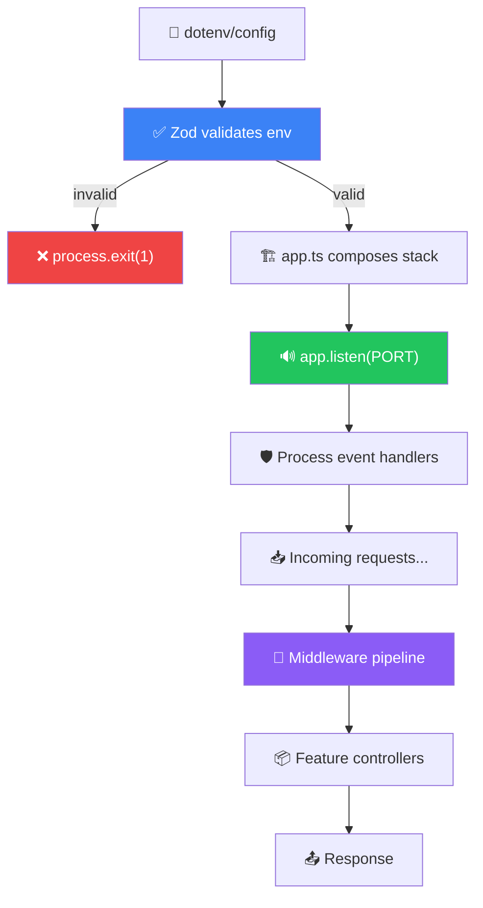
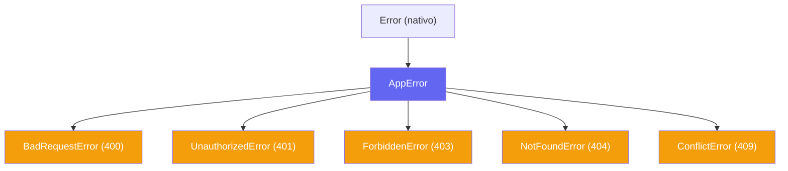

# 🎓 Guía de Aprendizaje — Módulo Core Platform

> **Objetivo:** Que entiendas cada pieza del runtime de CoPark de principio a fin, puedas explicar por qué se hizo así, y defender las decisiones en una entrevista técnica.
> **Requisito previo:** Conocimiento básico de TypeScript, Express, y Node.js.

---

## El Concepto Central: "El Runtime como Contrato"

Antes de que tu API procese un solo request de negocio, necesita resolver:

```
1. ¿La configuración es válida?              → env.ts
2. ¿Las dependencias están conectadas?       → prisma.ts
3. ¿El request es seguro y bien formado?     → helmet, cors, parsers
4. ¿Quién hizo el request?                   → auth middleware
5. ¿Qué pasa si algo falla?                  → error handler
6. ¿Cómo observo lo que está pasando?        → logging
7. ¿Cómo se apaga el servidor sin perder datos? → graceful shutdown
```

Este módulo es la capa que **garantiza** todas esas respuestas antes de llegar a la lógica de negocio. Si alguna falla, el proceso lo sabe y reacciona de forma predecible.

---

## El Viaje Completo: Del Boot al Shutdown



---

## Fase 1: Bootstrap — Arranque Determinista

### ¿Qué pasa cuando ejecutás `pnpm dev`?

**Archivo:** [server.ts](file:///d:/Users/Daniel/01_Projects/copark/copark-api/server.ts)

```typescript
import 'dotenv/config'; // 1. Carga .env → process.env
import app from './app.js'; // 2. Importa app → dispara toda la composición
import { env } from './src/config/env.js'; // 3. Accede config ya validada

const server = app.listen(env.PORT, () => {
  logger.info(`CoPark API running on port ${String(env.PORT)}`);
});
```

**Lo que pasa internamente en orden:**

1. `dotenv/config` lee `.env` y carga las variables en `process.env`
2. Al importar `./app.js`, Node.js resuelve sus dependencias — eso incluye importar `env.ts`
3. `env.ts` ejecuta la validación Zod **inmediatamente al ser importado** (top-level)
4. Si falla → `process.exit(1)` con error legible. Si pasa → `env` queda exportado
5. `app.ts` compone la pila de middlewares y monta las rutas
6. `server.ts` llama `app.listen()` y registra los handlers de ciclo de vida

> [!IMPORTANT]
> El orden de imports en `server.ts` no es casual. `dotenv/config` **debe** ejecutarse primero porque `env.ts` lee de `process.env`. Si invertís el orden, Zod validaría un objeto vacío y el proceso moriría.

---

## Fase 2: Validación de Configuración — Fail Fast

**Archivo:** [env.ts](file:///d:/Users/Daniel/01_Projects/copark/copark-api/src/config/env.ts)

```typescript
const envSchema = z.object({
  NODE_ENV: z.enum(['development', 'production', 'test']).default('development'),
  PORT: z.coerce.number().default(3000),
  DATABASE_URL: z.string().min(1),
  JWT_SECRET: z.string().min(32),
  JWT_EXPIRES_IN: z.string().default('24h'),
  CORS_ORIGINS: z.string().optional(),
  LOG_LEVEL: z.enum(['fatal', 'error', 'warn', 'info', 'debug', 'trace']).default('info'),
  LOG_PRETTY: z.coerce.boolean().default(false),
  API_BASE_URL: z.url().optional(),
});
```

### ¿Por qué `.coerce`?

`process.env` solo contiene strings. Cuando necesitás un `number` o `boolean`, `.coerce` convierte automáticamente:

```
process.env.PORT = "3000"     → z.coerce.number() → 3000
process.env.LOG_PRETTY = "true" → z.coerce.boolean() → true
```

Sin coerce, Zod rechazaría `"3000"` porque espera un `number`.

### El Guard de Producción

```typescript
.superRefine((value, ctx) => {
  if (value.NODE_ENV !== 'production') return;

  const hasCorsOrigins = Boolean(
    value.CORS_ORIGINS?.split(',').map(o => o.trim()).filter(Boolean).length
  );

  if (!hasCorsOrigins) {
    ctx.addIssue({
      code: 'custom',
      path: ['CORS_ORIGINS'],
      message: 'Required in production',
    });
  }
});
```

**¿Por qué importa?** En producción, dejar CORS abierto es una vulnerabilidad real. Este refinement asegura que no puedas deployar sin configurar los orígenes permitidos. En desarrollo no aplica para no bloquear el trabajo local.

### ¿Qué es `safeParse` + `process.exit` y por qué no `parse`?

```typescript
const parsed = envSchema.safeParse(process.env);
if (!parsed.success) {
  console.error('Invalid environment variables:');
  console.error(z.treeifyError(parsed.error));
  process.exit(1); // ← Fail fast
}
```

- `safeParse` **no lanza excepciones**. Retorna `{ success, data, error }`.
- Esto permite mostrar **todos** los errores de una vez (`treeifyError`) antes de morir.
- Si usaras `parse`, el proceso tiraría una excepción con el primer error y no verías los demás.

> [!TIP]
> `z.treeifyError()` genera un árbol legible. En la terminal se ve algo como:
>
> ```
> ├── DATABASE_URL: Required
> └── JWT_SECRET: Min 32 chars
> ```

---

## Fase 3: Composición del Pipeline de Middlewares

**Archivo:** [app.ts](file:///d:/Users/Daniel/01_Projects/copark/copark-api/app.ts)

### El pipeline completo, visualizado


### Cada middleware explicado

#### 1. `trust proxy`

```typescript
app.set('trust proxy', 1);
```

CoPark corre en Render detrás de un reverse proxy. Sin esto:

- `req.ip` mostraría la IP del proxy, no del cliente
- `req.protocol` siempre diría `http` aunque llegue por HTTPS
- Rate limiters (futuro) contarían todas las requests como de una sola IP

El `1` significa "confiar en 1 nivel de proxy". Si hubiera dos proxies, sería `2`.

#### 2. Request Logger (pino-http)

**Archivo:** [logger.middleware.ts](file:///d:/Users/Daniel/01_Projects/copark/copark-api/src/middlewares/logger.middleware.ts)

```typescript
export const requestLogger = pinoHttp({
  logger,
  genReqId: (req, res) => {
    const incoming = req.headers['x-request-id'];
    const id = Array.isArray(incoming) ? incoming[0] : incoming;
    const reqId = typeof id === 'string' && id.trim().length > 0 ? id : randomUUID();
    res.setHeader('x-request-id', reqId);
    return reqId;
  },
  customProps: (req) => ({ ip: req.ip }),
});
```

**¿Qué es `x-request-id` y por qué importa?**

Es un identificador único por request. Si un cliente envía un ID, lo reutilizamos para correlación (útil en microservicios). Si no, generamos uno con `randomUUID()`.

**Caso real:** Un usuario reporta un error. Te da el ID del request. Buscás ese ID en los logs y ves todo el recorrido: qué endpoint, qué parámetros, qué error, cuánto tardó.

#### 3. Helmet

```typescript
app.use(helmet());
```

Agrega headers HTTP de seguridad automáticamente:

- `X-Content-Type-Options: nosniff` → Previene MIME sniffing
- `X-Frame-Options: SAMEORIGIN` → Protege contra clickjacking
- `Strict-Transport-Security` → Fuerza HTTPS
- `Content-Security-Policy` → Controla qué recursos puede cargar el browser

> [!NOTE]
> Helmet va **después** del logger y **antes** de CORS. Así se loguean incluso los requests que Helmet rechazaría, pero los headers de seguridad siempre están presentes.

#### 4. CORS

```typescript
const corsOptions: CorsOptions = {
  origin: (origin, callback) => {
    if (!origin) return callback(null, true);
    if (env.NODE_ENV !== 'production') return callback(null, true);
    if (corsOrigins.has(origin)) return callback(null, true);
    callback(new ForbiddenError('CORS origin not allowed'));
  },
};
```

**Tres caminos posibles:**

| Escenario                    | `origin`             | Resultado                       |
| ---------------------------- | -------------------- | ------------------------------- |
| curl / server-to-server      | `undefined`          | ✅ Permitido (no hay browser)   |
| Desarrollo                   | cualquiera           | ✅ Permitido (no restrictivo)   |
| Producción + origen válido   | `https://copark.com` | ✅ Permitido (está en la lista) |
| Producción + origen inválido | `https://hacker.com` | ❌ `ForbiddenError`             |

**¿Por qué un `Set` y no un array?**

```typescript
const corsOrigins = new Set(
  env.CORS_ORIGINS?.split(',')
    .map((o) => o.trim())
    .filter(Boolean) ?? [],
);
```

`Set.has()` es O(1). Un `Array.includes()` es O(n). Con pocos orígenes no importa, pero es un hábito profesional correcto.

#### 5. Body Parsers con Límite

```typescript
app.use(express.json({ limit: '10kb' }));
app.use(express.urlencoded({ extended: false, limit: '10kb' }));
```

- `limit: '10kb'` → Si alguien envía un body mayor a 10kb, Express genera un error con `status: 413` que el error handler captura como "Payload too large".
- `extended: false` → Usa `querystring` simple (no soporta objetos anidados). Suficiente para esta API.

---

## Fase 4: El Logger de Aplicación

**Archivo:** [logger.ts](file:///d:/Users/Daniel/01_Projects/copark/copark-api/src/lib/logger.ts)

```typescript
export const logger = pino({
  level: env.LOG_LEVEL,
  base: { service: 'copark-api', env: env.NODE_ENV },
  redact: {
    paths: [
      'req.headers.authorization', 'req.headers.cookie',
      'req.body.password', 'req.body.token',
      '*.password', '*.token',
    ],
    remove: true,
  },
  transport: isPretty ? { target: 'pino-pretty', ... } : undefined,
});
```

### ¿Por qué Pino y no console.log o Winston?

| Característica      | `console.log` | Winston      | Pino                    |
| ------------------- | ------------- | ------------ | ----------------------- |
| Formato             | texto libre   | configurable | JSON nativo             |
| Performance         | bloqueante    | medio        | más rápido (async I/O)  |
| Structured logging  | ❌            | ✅           | ✅                      |
| Request correlación | manual        | manual       | integrado con pino-http |

Pino genera logs JSON por defecto, perfectos para plataformas como Render, Datadog, o CloudWatch.

### `redact` — Seguridad en Logs

```typescript
redact: {
  paths: ['req.headers.authorization', '*.password', '*.token'],
  remove: true,  // ← no enmascara, ELIMINA el campo
}
```

**`remove: true` vs `remove: false`:**

- `false` → `{ password: "[Redacted]" }` (sabés que existía)
- `true` → `{}` (el campo NO aparece en el log)

CoPark usa `true`. En producción, ni siquiera querés saber que había un campo `password` en el body.

### `pino-pretty` solo en desarrollo

```typescript
const isPretty = env.NODE_ENV !== 'production' && env.LOG_PRETTY;
```

En dev con `LOG_PRETTY=true` ves logs legibles con colores. En producción, JSON crudo para que los agregadores los parseen.

---

## Fase 5: Sistema de Errores

### La Jerarquía



### `AppError` — La Clase Base

**Archivo:** [app-error.ts](file:///d:/Users/Daniel/01_Projects/copark/copark-api/src/errors/app-error.ts)

```typescript
export class AppError extends Error {
  public readonly statusCode: number;
  public readonly isOperational: boolean;

  constructor(message: string, statusCode = 500, isOperational = statusCode < 500) {
    super(message);
    this.name = this.constructor.name;
    Error.captureStackTrace(this, this.constructor);
  }
}
```

**Concepto clave: `isOperational`**

| `isOperational` | Significado                            | Ejemplo                     | Log level |
| --------------- | -------------------------------------- | --------------------------- | --------- |
| `true`          | Error esperado, parte del flujo normal | "User not found" (404)      | `warn`    |
| `false`         | Bug, algo que no debería pasar         | TypeError, null dereference | `error`   |

**¿Por qué `statusCode < 500`?** Porque los errores 4xx son "culpa del cliente" (operacionales), y los 5xx son "culpa del servidor" (bugs). El default detecta esto automáticamente.

### Subclases HTTP — Mínimas por Diseño

**Archivo:** [http-errors.ts](file:///d:/Users/Daniel/01_Projects/copark/copark-api/src/errors/http-errors.ts)

```typescript
export class NotFoundError extends AppError {
  constructor(message = 'Resource not found') {
    super(message, 404);
  }
}
```

Solo setean `message` y `statusCode`. No tienen lógica extra. **Esto es intencional:** la lógica de error vive centralizada en el error handler, no dispersa en subclases.

### El Error Handler — Cerebro Central

**Archivo:** [error-handler.middleware.ts](file:///d:/Users/Daniel/01_Projects/copark/copark-api/src/middlewares/error-handler.middleware.ts)

```typescript
export const errorHandler = (err: unknown, req: Request, res: Response, next: NextFunction) => {
  // 1. Si ya se enviaron headers → delegar a Express
  if (res.headersSent) { next(err); return; }

  const normalizedError = toErrorWithStatus(err);

  // 2. Payload too large → 413
  if (isEntityTooLargeError(normalizedError)) { ... }

  // 3. JSON mal formado → 400
  if (isJsonSyntaxError(normalizedError)) { ... }

  // 4. AppError operacional → status code + message
  if (normalizedError instanceof AppError && normalizedError.isOperational) { ... }

  // 5. Todo lo demás → 500 genérico
  return res.status(500).json({ error: true, message: 'Internal Server Error' });
};
```

**¿Por qué `err: unknown` y no `err: Error`?**

Porque en JavaScript, `throw` puede lanzar **cualquier cosa**: un string, un número, un objeto plano. La función `toErrorWithStatus()` normaliza todo esto a un Error con propiedades consistentes.

**¿Qué es `headersSent`?**

Si un controller ya empezó a enviar la respuesta (ej: streaming) y después tira un error, no podés enviar otro response. Express crashearía con "Cannot set headers after they are sent". El guard `headersSent` previene esto delegando al handler por defecto de Express.

### Contrato de Error — Consistencia Absoluta

**Todo** error que sale de la API tiene esta forma:

```json
{ "error": true, "message": "..." }
```

No importa si es un 400, 404, 413, o 500. El cliente siempre puede hacer:

```typescript
if (response.error) {
  showError(response.message);
}
```

---

## Fase 6: Middlewares de Infraestructura

### Validation Middleware

**Archivo:** [validation.middleware.ts](file:///d:/Users/Daniel/01_Projects/copark/copark-api/src/middlewares/validation.middleware.ts)

```typescript
export function validateRequest(schemas: ValidateRequestSchemas): RequestHandler {
  return async (req, res, next) => {
    if (schemas.body) {
      const result = await schemas.body.safeParseAsync(req.body);
      if (!result.success) {
        const msg = result.error.issues.map((i) => `${i.path.join('.')}: ${i.message}`).join(', ');
        next(new BadRequestError(msg));
        return;
      }
      req.body = result.data; // ← Reemplaza con datos validados y coercionados
    }
    // Lo mismo para params y query...
    next();
  };
}
```

**¿Por qué `req.body = result.data`?**

Zod valida pero también transforma: coerce tipos, aplica defaults, stripea campos extra si el schema es `strict`. Al reemplazar `req.body`, el controller recibe datos **limpios y tipados**, no el input crudo del usuario.

**¿Por qué `safeParseAsync` y no `safeParse`?**

Algunos schemas pueden tener refinements asíncronos (ej: verificar unicidad en DB). `safeParseAsync` soporta ambos casos.

### Auth Middleware

**Archivo:** [auth.middleware.ts](file:///d:/Users/Daniel/01_Projects/copark/copark-api/src/middlewares/auth.middleware.ts)

```typescript
export const requireAuth = async (req, res, next): Promise<void> => {
  const header = req.headers.authorization;

  if (!header?.startsWith('Bearer ')) {
    next(new UnauthorizedError('Missing token'));
    return;
  }

  const token = header.split(' ')[1];

  try {
    const payload = await verifyAccessToken(token);
    req.user = { id: payload.sub };
    next();
  } catch {
    next(new UnauthorizedError('Invalid or expired token'));
  }
};
```

**Flujo:**

```
Authorization: Bearer eyJhbG...
                      ↓
            header.split(' ')[1] → token
                      ↓
          verifyAccessToken(token) → { sub: 'user-uuid' }
                      ↓
           req.user = { id: 'user-uuid' }
                      ↓
            next() → controller puede usar req.user.id
```

**Type augmentation:** `req.user` existe gracias a `src/types/express.d.ts`:

```typescript
declare global {
  namespace Express {
    interface Request {
      user?: { id: string };
    }
  }
}
```

Esto "inyecta" el campo `user` en la interfaz `Request` de Express sin modificar el paquete original. Es un patrón de TypeScript llamado **declaration merging**.

---

## Fase 7: Graceful Shutdown — Apagar sin Romper Nada

**Archivo:** [server.ts](file:///d:/Users/Daniel/01_Projects/copark/copark-api/server.ts)

### ¿Cuándo ocurre un shutdown?

| Señal                | Cuándo pasa                      | Ejemplo                    |
| -------------------- | -------------------------------- | -------------------------- |
| `SIGINT`             | Ctrl+C en terminal               | Desarrollo local           |
| `SIGTERM`            | El orquestador pide apagar       | Render deploy, Docker stop |
| `unhandledRejection` | Promise rechazada sin `.catch()` | Bug en código async        |
| `uncaughtException`  | Error fuera de un try/catch      | TypeError inesperado       |

### La secuencia paso a paso

```typescript
async function shutdown(signal: string): Promise<void> {
  if (isShuttingDown) return; // ← 1. Guard contra ejecución duplicada
  isShuttingDown = true;

  const forceCloseTimer = setTimeout(() => {
    process.exit(1); // ← 2. Forzar cierre si pasan 10s
  }, 10_000);
  forceCloseTimer.unref(); // ← 3. No mantener el event loop vivo

  try {
    await closeServer(server); // ← 4. Dejar de aceptar conexiones
    await prisma.$disconnect(); // ← 5. Cerrar pool de DB
    clearTimeout(forceCloseTimer);
    process.exit(0); // ← 6. Salir limpio
  } catch (error) {
    process.exit(1); // ← 7. Salir con error
  }
}
```

### ¿Por qué `isShuttingDown`?

Porque pueden llegar **múltiples señales** casi simultáneamente. Por ejemplo, `SIGTERM` seguido de `SIGINT`. Sin el guard, intentarías cerrar el server dos veces y la segunda fallaría.

### ¿Qué es `unref()` y por qué importa?

Node.js mantiene el proceso vivo mientras haya timers o I/O pendiente. `unref()` le dice al event loop: "este timer no cuenta para mantener el proceso vivo". Así:

- Si el shutdown termina en 2 segundos, el proceso se cierra en 2 segundos (no espera los 10).
- Si el shutdown está trabado, el timer de 10 segundos lo mata forzadamente.

### ¿Qué pasa con las requests en vuelo?

`server.close()` **no mata conexiones activas**. Hace esto:

1. Deja de aceptar conexiones nuevas
2. Espera que las conexiones activas terminen naturalmente
3. Una vez que todas terminan, ejecuta el callback

Si una request tarda más de 10 segundos, el `forceCloseTimer` mata el proceso. Es un trade-off: priorizamos no quedar colgados sobre terminar todas las requests.

---

## Fase 8: Base de Datos — El Mínimo Necesario

**Archivo:** [prisma.ts](file:///d:/Users/Daniel/01_Projects/copark/copark-api/src/config/prisma.ts)

```typescript
import { PrismaPg } from '@prisma/adapter-pg';
import { PrismaClient } from '../../prisma/generated/client.js';
import { env } from './env.js';

const adapter = new PrismaPg({ connectionString: env.DATABASE_URL });
const prisma = new PrismaClient({ adapter });

export { prisma };
```

**¿Por qué `PrismaPg` adapter en vez del client directo?**

El patrón driver adapter permite a Prisma usar el driver `pg` de Node.js directamente en vez de su propio engine binario. Beneficio: builds más livianos y compatibilidad con más plataformas.

**¿Por qué un solo `PrismaClient`?**

Cada instancia de `PrismaClient` abre un pool de conexiones. Si creás una instancia por request, agotás las conexiones de la DB en segundos. Un singleton compartido es el patrón correcto.

---

## 🧪 Auto-Evaluación

Respondé estas preguntas para verificar tu comprensión. Si podés explicar cada una en tus propias palabras, dominás este módulo.

### Nivel Básico

1. **¿Qué pasa si `DATABASE_URL` no está definida en `.env`?**
   - `env.ts` falla en `safeParse`, muestra el error con `treeifyError`, y hace `process.exit(1)` antes de que el servidor arranque.

2. **¿Por qué el request logger va antes de Helmet?**
   - Para que incluso los requests que Helmet rechace o modifique queden logueados con su request ID.

3. **¿Qué diferencia hay entre `AppError` y un `Error` genérico en el error handler?**
   - `AppError` tiene `isOperational: true` → se loguea como `warn` y el cliente ve el mensaje original. Un Error genérico → se loguea como `error` y el cliente recibe "Internal Server Error".

### Nivel Intermedio

4. **¿Por qué CORS usa un `Set` en vez de un array?**
   - Lookup O(1) vs O(n). Más importante: refleja intención profesional y buen hábito.

5. **¿Qué pasaría si quitás `forceCloseTimer.unref()`?**
   - El proceso siempre tardaría 10 segundos en apagarse, incluso si el shutdown se completó antes, porque el timer mantiene vivo el event loop.

6. **¿Por qué `validateRequest` reemplaza `req.body` con `result.data`?**
   - Porque Zod no solo valida, también transforma (coerce, defaults, strip). El controller necesita recibir los datos ya procesados, no el input crudo.

### Nivel Avanzado

7. **¿Qué problema resuelve `toErrorWithStatus()` en el error handler?**
   - JavaScript permite `throw "algo"` o `throw { message: "x" }`. Sin normalización, el handler crashearía al acceder a propiedades de un no-objeto. `toErrorWithStatus` convierte cualquier cosa a un Error válido.

8. **¿Por qué `api-docs.ts` tiene su propio Helmet separado del global?**
   - Scalar UI necesita cargar scripts y fonts desde CDNs (jsdelivr, Google Fonts). El Helmet global bloquearía esos recursos. El Helmet de docs tiene una CSP relajada solo para las rutas de documentación.

9. **¿Qué pasaría si dos `SIGTERM` llegan en 100ms?**
   - El guard `isShuttingDown` evita que `shutdown()` se ejecute dos veces. El segundo `SIGTERM` retorna inmediatamente sin hacer nada.

10. **¿Podés explicar un request completo de principio a fin?**

```
GET /users/123
  → pino-http loguea req, genera/propaga x-request-id
  → helmet agrega headers de seguridad
  → cors verifica origen (ok en dev, allowlist en prod)
  → json/urlencoded parsers ignoran GET sin body
  → no matchea /healthz ni docs → sigue al feature router
  → userRouter.get('/:id', requireAuth, validateRequest({params}), controller)
  → requireAuth extrae Bearer token → verifica JWT → req.user = { id }
  → validateRequest parsea params con Zod → req.params.id tipado
  → controller busca en DB, retorna JSON
  → pino-http loguea response (status, duration)
```

---

## 🛠️ Ejercicios Prácticos

### 1. Agregar una nueva variable de entorno

Querés agregar `RATE_LIMIT_MAX` para limitar requests por IP:

1. Agregar al schema en `env.ts`:
   ```typescript
   RATE_LIMIT_MAX: z.coerce.number().default(100),
   ```
2. Agregar al `.env`:
   ```
   RATE_LIMIT_MAX=100
   ```
3. Usar en el código: `env.RATE_LIMIT_MAX`
4. Actualizar `.env.example` para documentar

### 2. Crear un nuevo error HTTP

Querés un `429 Too Many Requests`:

```typescript
// src/errors/http-errors.ts
export class TooManyRequestsError extends AppError {
  constructor(message = 'Too many requests') {
    super(message, 429);
  }
}
```

El error handler ya lo maneja automáticamente: es un `AppError` con `statusCode < 500`, así que `isOperational = true` y el cliente recibe el mensaje.

### 3. Simular un shutdown

En desarrollo, presioná Ctrl+C y observá los logs:

```
{"level":30,"signal":"SIGINT","msg":"Received shutdown signal"}
{"level":30,"msg":"Shutdown completed"}
```

Si querés ver el force-close, podés agregar un `await new Promise(r => setTimeout(r, 15000))` antes de `closeServer` y ver cómo el timer de 10s lo mata.
